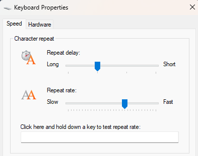

# Key Repeat Tuner

Key Repeat Tuner is a personal Windows utility that changes keyboard repeat settings when configured applications are running, then restores the default settings when they exit.

It was built as a small automation/internal-tools project: a background worker observes Windows process state, applies configuration-driven keyboard settings through Windows APIs and registry values, and is packaged with a WiX MSI installer.

## Project Status

- Personal/portfolio Windows utility.
- Windows-only. The application targets `net8.0-windows`, uses Windows Management Instrumentation, and reads/writes Windows keyboard registry settings.
- Not claimed as enterprise-deployed or production corporate software.
- Demonstrates .NET/Windows automation, configuration-driven behavior, unit and system testing, and installer packaging.
- Current runtime expects administrator privileges so it can apply Windows keyboard repeat settings.

## What It Does

- Watches configured process names such as `starcraft` or `notepad`.
- Applies `FastMode` keyboard repeat settings while any watched process is running.
- Restores configured default settings after the last watched process exits.
- Runs as a Windows background application.
- Stores user configuration in `appsettings.json`.

The behavior matches the Windows **Keyboard Properties** repeat delay and repeat rate controls:



## Installation

The latest published release, `v1.1.0`, includes `KeyRepeatTuner.Setup.msi`.

1. Download the MSI from the [Releases page](https://github.com/Courtland9777/key-repeat-tuner/releases).
2. Run the installer on Windows. The MSI installs per-machine under `C:\Program Files\Key Repeat Tuner`, so Windows may request elevation during installation.
3. Run Key Repeat Tuner with administrator privileges.
4. Edit the per-user configuration file:

```text
%APPDATA%\KeyRepeatTuner\appsettings.json
```

On first run, the application creates the per-user configuration from the installed `appsettings.json` template if the AppData file does not already exist.

The installer is configured to add current-user startup behavior and provide Start Menu shortcuts for editing settings and uninstalling.

Example configuration:

```json
{
  "AppSettings": {
    "ProcessNames": [ "starcraft", "notepad" ],
    "KeyRepeat": {
      "Default": {
        "RepeatSpeed": 20,
        "RepeatDelay": 1000
      },
      "FastMode": {
        "RepeatSpeed": 31,
        "RepeatDelay": 500
      }
    }
  }
}
```

## Build and Test

Development and packaging are intended to run on Windows with the .NET 8 SDK. The repository includes `global.json` requesting SDK `8.0.407` with latest-patch roll-forward.

Restore dependencies:

```powershell
dotnet restore .\KeyRepeatTuner.sln
```

Build the solution:

```powershell
dotnet build .\KeyRepeatTuner.sln -c Release -p:Platform=x64
```

Run unit tests:

```powershell
dotnet test .\KeyRepeatTuner.Tests\KeyRepeatTuner.Tests.csproj -c Release -p:Platform=x64
```

Run system tests on Windows as Administrator:

```powershell
dotnet test .\KeyRepeatTuner.SystemTests\KeyRepeatTuner.SystemTests.csproj -c Release -p:Platform=x64
```

The system tests interact with Windows process state and keyboard registry settings, start Windows processes such as `cmd.exe` and `notepad.exe`, and require administrator privileges.

Publish the self-contained Windows application:

```powershell
dotnet publish .\KeyRepeatTuner\KeyRepeatTuner.csproj -c Release -r win-x64 -p:PublishProfile=FolderProfile
```

Build the WiX installer:

```powershell
dotnet build .\KeyRepeatTuner.Setup\KeyRepeatTuner.Setup.wixproj -c Release -p:Platform=x64
```

The WiX project publishes the application before packaging and outputs the MSI under the setup project's release output folder.

## Technical Notes

| Area | Implementation |
| --- | --- |
| Runtime | .NET 8 worker application targeting `net8.0-windows` |
| Windows integration | WMI process monitoring and keyboard registry settings |
| Configuration | `appsettings.json` with default and fast-mode key repeat settings |
| Logging | Serilog sinks for console, Event Log, and file logging |
| Tests | xUnit and Moq unit tests, plus administrator-only Windows system tests |
| Packaging | WiX Toolset SDK project for MSI packaging |

## Limits and Assumptions

- This is a focused personal utility, not a general Windows administration tool.
- The process-name matching is configuration-driven and expects executable names without `.exe`.
- The repository includes administrator-only system tests; run them only on a Windows environment where changing keyboard repeat settings is acceptable.
- The published installer is intended for `win-x64`.

## Repository

- GitHub: [Courtland9777/key-repeat-tuner](https://github.com/Courtland9777/key-repeat-tuner)
- Latest release checked during this README update: `v1.1.0`, published April 30, 2025, with `KeyRepeatTuner.Setup.msi`.

## License

MIT. See [LICENSE](LICENSE).
