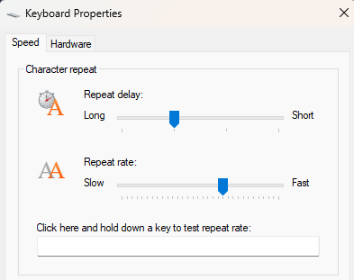

# Key Repeat Tuner

**Tweak your Windows keyboard repeat speed and delay automatically when your favorite games launch.**  
Key Repeat Tuner is a lightweight background service that watches for specified processes (like `starcraft.exe`) and dynamically adjusts your system's keyboard responsiveness.



## Why It Matters

For real-time strategy gamers and competitive players, keyboard responsiveness can make or break a moment.  
This tool automates what you'd otherwise do manually in **Keyboard Properties**:  
- Adjust the **Repeat rate** and **Repeat delay** sliders before and after gaming sessions.

Key Repeat Tuner:
- ?? Applies "FastMode" settings when your game is running  
- ?? Reverts to default when the game closes  
- ?? Works silently in the background

---

## Features

- Automatically detects running processes
- Configurable key repeat rate (0�31) and delay (250�1000 ms)
- Uses native Windows API and registry operations
- Delivered as a Windows service with WiX installer
- Easy config override via `appsettings.json`

---

## Installation

1. **Download the Installer**

Get the latest MSI from the [Releases page](https://github.com/Courtland9777/key-repeat-tuner/releases)

2. **Run the Installer**

The app installs to `C:\Program Files\Key Repeat Tuner` and:
- Starts automatically on login
- Adds a Start Menu shortcut to edit your config
- Includes an uninstall shortcut

3. **Configure Watched Games**

Update your settings in:
```plaintext
%APPDATA%\KeyRepeatTuner\appsettings.json
```

Example:
```json
{
  "AppSettings": {
    "ProcessNames": [ "starcraft", "notepad" ],
    "KeyRepeat": {
      "Default": {
        "RepeatSpeed": 20,
        "RepeatDelay": 1000
      },
      "FastMode": {
        "RepeatSpeed": 31,
        "RepeatDelay": 500
      }
    }
  }
}
```

---

## How It Works

- The app uses WMI to track process start/stop events
- When a watched process starts, `FastMode` settings are applied
- When the last watched process exits, settings are reverted

These match the **Repeat delay** and **Repeat rate** sliders in Windows:


No reboots. No manual toggles. Just smooth transitions.

---

## Testing

Included system-level tests validate:
- Registry settings applied correctly
- Keyboard behavior during process changes
- Logs are written on change events

Run `KeyRepeatTuner.SystemTests` for full test coverage.

---

## Tech Stack

| Tech                  | Purpose                                  |
|-----------------------|------------------------------------------|
| .NET 8                | Core app logic (worker service)          |
| WMI / Registry APIs   | Detect processes and modify settings     |
| Serilog               | Logging (EventLog + file)                |
| xUnit + Moq           | Test coverage                            |
| WiX Toolset           | MSI Installer, auto-start setup          |

---

## FAQ

- **Does it support multiple processes?**  
  Yes � if *any* watched process is active, FastMode remains on.

- **Does it require .NET to be installed?**  
  No � the runtime is bundled (self-contained .NET 8 build).

- **Is it safe?**  
  Absolutely. Admin privileges are used only to update registry values under your user profile.

---

## Made for Gamers

Inspired by the hassle of manual tweaks before ladder matches and Pig's Bronze to GM videos. 
Whether you�re climbing to GM or just laddering for fun, this utility makes sure your keyboard is tuned for peak responsiveness every time.

---

## Project

- GitHub: [Courtland9777/key-repeat-tuner](https://github.com/Courtland9777/key-repeat-tuner)

## License

MIT
